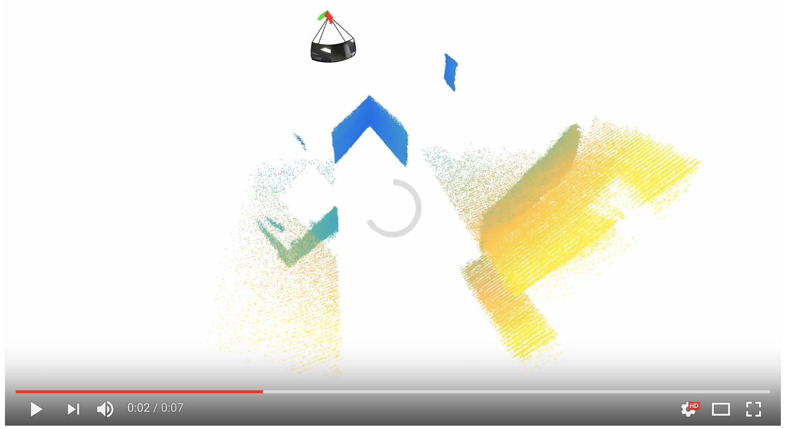

<a href="https://www.ultralytics.com/"></a>

# 🌟 Ultralytics Kinect

[](https://github.com/ultralytics/kinect/actions/workflows/format.yml)
[](https://discord.com/invite/ultralytics)
[](https://community.ultralytics.com/)
[](https://reddit.com/r/ultralytics)

Welcome to the [Ultralytics Kinect](https://github.com/ultralytics/kinect) repository! This project showcases advanced **3D scene reconstruction** algorithms utilizing data captured by the [Microsoft Kinect sensor](https://en.wikipedia.org/wiki/Kinect), a pioneering [depth-imaging](https://www.ultralytics.com/glossary/depth-estimation) device. Explore our implementation of cutting-edge techniques in [computer vision](https://www.ultralytics.com/glossary/computer-vision-cv) and see the results in action through example videos on the [Ultralytics YouTube channel](https://www.youtube.com/ultralytics).

[](https://youtu.be/dqK5DkgTGyk "Click to Watch the 3D Reconstruction Demo!")

## Prerequisites 🛠️

Before starting, ensure you have [MATLAB](https://www.mathworks.com/products/matlab.html) R2018a or newer installed. You'll also need our repository of common MATLAB functions. Clone it using the following command:

```shell
git clone https://github.com/ultralytics/functions-matlab
```

After cloning, add this repository and the common-functions repository to your MATLAB path. Replace `/path/to/` with the actual directories where you cloned the repositories:

```matlab
addpath(genpath('/path/to/kinect')) % Add this repo so data/kinect_single.mat is discoverable
addpath(genpath('/path/to/functions-matlab')) % Add the common functions repo
```

Additionally, confirm that the following MATLAB toolboxes are installed:

- [Statistics and Machine Learning Toolbox](https://www.mathworks.com/products/statistics.html)
- [Signal Processing Toolbox](https://www.mathworks.com/products/signal.html)
- [Computer Vision Toolbox](https://www.mathworks.com/products/computer-vision.html)
- [Image Processing Toolbox](https://www.mathworks.com/products/image.html)

For more details on setting up development environments, check out the general [Ultralytics documentation](https://docs.ultralytics.com/).

## How to Run 🏃

To launch the 3D scene reconstruction process, simply run the `buildscene` command within your MATLAB environment:

```matlab
buildscene % Start the 3D reconstruction process
```

This script initiates the reconstruction using the provided Kinect data and the implemented algorithms. For a general overview of running Ultralytics projects, see our [Quickstart Guide](https://docs.ultralytics.com/quickstart).

## 💡 Contribute

Ultralytics thrives on community collaboration, and we deeply value your contributions! Whether it's reporting bugs, suggesting features, or submitting code changes, your involvement is crucial.

- **Reporting Issues**: Encounter a bug? Please report it on [GitHub Issues](https://github.com/ultralytics/kinect/issues).
- **Feature Requests**: Have an idea for improvement? Share it via [GitHub Issues](https://github.com/ultralytics/kinect/issues).
- **Pull Requests**: Want to contribute code? Please read our [Contributing Guide](https://docs.ultralytics.com/help/contributing) first, then submit a Pull Request.
- **Feedback**: Share your thoughts and experiences by participating in our official [Survey](https://www.ultralytics.com/survey?utm_source=github&utm_medium=social&utm_campaign=Survey).

A heartfelt thank you 🙏 goes out to all our contributors! Your efforts help make Ultralytics tools better for everyone.

[](https://github.com/ultralytics/ultralytics/graphs/contributors)

## 📄 License

Ultralytics offers two licensing options to accommodate diverse needs:

- **AGPL-3.0 License**: Ideal for students, researchers, and enthusiasts passionate about open collaboration and knowledge sharing. This [OSI-approved](https://opensource.org/license/agpl-3.0) open-source license promotes transparency and community involvement. See the [LICENSE](LICENSE) file for details.
- **Enterprise License**: Designed for commercial applications, this license permits the seamless integration of Ultralytics software and AI models into commercial products and services, bypassing the copyleft requirements of AGPL-3.0. For commercial use cases, please inquire about an [Ultralytics Enterprise License](https://www.ultralytics.com/license).

## 📮 Contact

For bug reports or feature suggestions, please use [GitHub Issues](https://github.com/ultralytics/kinect/issues). For general questions, discussions, and community support, join our [Discord](https://discord.com/invite/ultralytics) server!

<br>
<div align="center">
  <a href="https://github.com/ultralytics"></a>
  
  <a href="https://www.linkedin.com/company/ultralytics/"></a>
  
  <a href="https://twitter.com/ultralytics"></a>
  
  <a href="https://www.youtube.com/ultralytics?sub_confirmation=1"></a>
  
  <a href="https://www.tiktok.com/@ultralytics"></a>
  
  <a href="https://ultralytics.com/bilibili"></a>
  
  <a href="https://discord.com/invite/ultralytics"></a>
</div>
